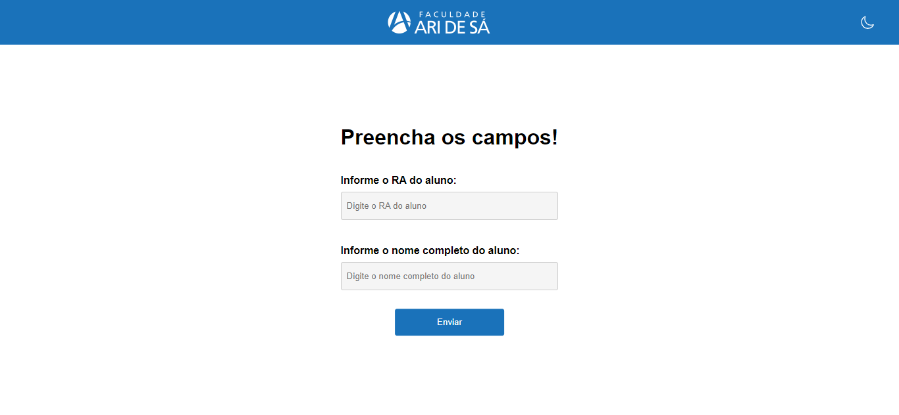

# Cadastro de Alunos nas Catracas

Sistema de chamado de cadastro de alunos nas catracas.

# Modo de Uso

Deve-se preencher o formulário inserindo a matrícula do aluno
e o nome completo. Após clickar no botão de enviar, será enviado
um e-mail com as informações do aluno inseridas para os responsáveis
do cadastro que irão realizar o cadastro no sistema de catracas 
a partir dos dados recebidos.

# Funcionamento
A aplicação é feita apenas com HTML, CSS e JavaScript, e utilizando a action, do formulário, do FormSubmit que disponibiliza o serviço, de método POST, de receber os dados e enviar ao email ou emails informados na action.

# Licença
Copyright (c) 2023 Faculdade Ari de Sá
